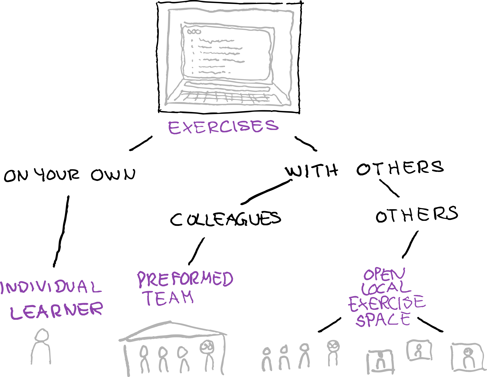

# CodeRefinery: Welcome and practical information for workshops

---

## Welcome everyone!

## Why are we here?

CodeRefinery is an addition to general coding classes, supporting you to make your code more reproducible.

## What is CodeRefinery

- Nordic project to teach basic scientific computing tools, funded by the Nordic e-Infrastructure Collaboration (https://neic.no)
- Runs this workshop, and others like it
- Community of research software enthusiasts

CodeRefinery is a partnership of Aalto university (FI),
CSC - IT Center for Science (FI), Center for Humanities Computing (DK), 
Danish e-Infrastructure Cooperation (DK),
EuroCC National Competence Center Sweden (ENCCS) (SE), National Academic Infrastructure for Super­computing in Sweden (NAISS) (SE) and NRIS/Sigma2 (NO).

## Who is here today?

~ 10 course coordinators, instructors and expert helpers

~ 6 exercise leaders

~ 250 participants from ~ 25 different countries

## Practical matters: how to attend

### How the workshop works

This is a livestreamed workshop! 

Everyone will watch the livestream of instructors talking and showing demos on Twitch. 

In week 1, there will also be exercises, which you can do in various ways: 

No dedicated (team) exercise time in week 2, but interaction via collaborative document. 

We plan on having a minimum 10 min break every hour.

The materials are always available for everyone, and linked from the Workshop page. 
All recordings will be available on twitch right away and on youtube the day after. 

### Collaborative Document

The collaborative doument is our connection to you. We use it:

- to distribute information to you.

- as a "chat":
  - let us know about accessibility issues
  - ask questions, get answers
  - anonymous ;)
  - 
  

- Please don't use the Twitch chat for questions about the content!

#### Collaborative document usage

You can switch between view and edit modes:

- You might have to switch to edit mode once to get live updates (then you can go back to view)
- Please leave in view mode if you aren't actively using it

**Hands-on for all: Collaborative document and icebreaker**

## Setup for the workshop

### Own course directory

We suggest to create a directory/folder for this course on your computer, where you can store all exercise materials etc., to make it easy to clean up later.  

### Screen arrangement

This workshop provides many things to keep track of. A screen setup suggestion...

We share a vertical window, so half of the screen is for us, and
  half is for your own work.

### Where to focus?

There is so much information!  

1. **Livestream** - first priority
2. **Collaborative document** - to find info or do Q&A
3. **Lesson material webpage** (as needed)

## Be respectful and helpful

If you know some of the material already, please help answering questions on the collaborative document.

Some advice:

- **Everyone here is at different levels, and that's expected.**
  Everyone will be learning different things, and everyone will focus
  on different topics.  Passive learning is OK.
- ***Everyone* here is both a teacher and a learner.**  Be careful
  that your help is at the right level, considering the above.
- **When something isn't going right, *use the collaborative document to let us know quickly***.
  We want to help, even if the answer is "let's discuss later".

## Code of Conduct

In the worst case, there may be problem with someone.  In that case,
we follow our [Code of
Conduct](https://coderefinery.org/about/code-of-conduct/).  

## Things that can (and will) go wrong

### There are major accessibility problems
- e.g. audio quality is bad, screen not visible, breaks not coming, unintelligble explanation...
- Write the problem in the bottom of the collaborative document immediately.

### An instructor/team leader makes a mistake
- No one knows everything.
- Seeing things go wrong and get fixed is part of the pedagogy.
- Please be nice to those who make this course possible.

### You get overloaded with information
- Don't worry!
- Change your watching style and know material will be available for you to watch later.
- Instant video replays help here, but the material is also open.

### Collaborative document is too fast to follow
- Don't follow it.  It will be published for future reference.
- Write your question and come back to it later.

### We can't solve your problems in the collaborative document
- We can answer many questions and give hints, but can't solve
  everything
- Some things are best solved by someone seeing your screen.
- Change your watching style and try to work it out later.
- **We recommend to ask your local IT support for technical questions or join our "bring your own code" sessions (see schedule!)**

### We deviate from the schedule
- We try to stay on track, but sometimes things do not go as planned and we have to leave out some (sub-)topic.

### Collaborative document lags and you can't edit / text goes wrong
- This sometimes happens with high load
- Everyone: Switch to "view mode" and wait for it to calm down.
- Wait a moment, workshop staff will move older content to archive, to lower the load.

### The stream suddenly dies
- Broadcaster's computer has crashed.
- Stay around and it will resume in about 5 minutes.

### You don't yet have some important software installed or configured
- Oops... but it's OK
- Switch to "watching" mode and work on fixing it for the next day.
- Check [installation instructions](https://coderefinery.github.io/installation/) to see what may be missing.

### You can't attend every day
- Attend only the parts you are interested in 
- Materials are always available
- Video availability right away on Twitch, next day on YouTube

### A cat visits one of the instructors
- <3

### The course is too cool and you want to know more
- Check out hints in the workshop-outro
- Join as a team leader next time
- Advertise to your organization to become a partner

## Final notes

### Please register if you haven't yet

- You will get emails from us with updates
- It helps us with our reporting and ensures funding
- You are registered if you got emails directly from us
- Registration via the [https://coderefinery.github.io/2024-03-12-workshop/](https://coderefinery.github.io/2024-03-12-workshop/)

### Privacy

- There is no way for your audio and video to end up broadcasted or
  recorded.
- **Don't put names or identifiable info in the collaborative document at any
  time**
- Collaborative document contents will be posted on the course page, without names.
- All outputs are CC-BY.

### Certificates

- Local teams at universities, ask your team leader
- [General instructions for getting a certificate](https://coderefinery.github.io/2024-03-12-workshop/certificates/)

### Join us!

- CodeRefinery is an open project, join us.
  - Website: https://coderefinery.org → Get Involved
  - Chat: https://coderefinery.github.io/manuals/chat/ (`#tools-workshop`)
  - CodeRefinery manuals: https://coderefinery.github.io/manuals/

We need volunteers to make this a success in the future.  We are also
happy to have institutional partners.

### Social media

Please share your experiences about the workshop!
- #CodeRefinery
- Mastodon: [@coderefinery@fosstodon.org](https://fosstodon.org/@coderery).
- Twitter: [@coderefine](https://twitter.com/coderefine)
- LinkedIn: [CodeRefinery](https://www.linkedin.com/company/88414793)
